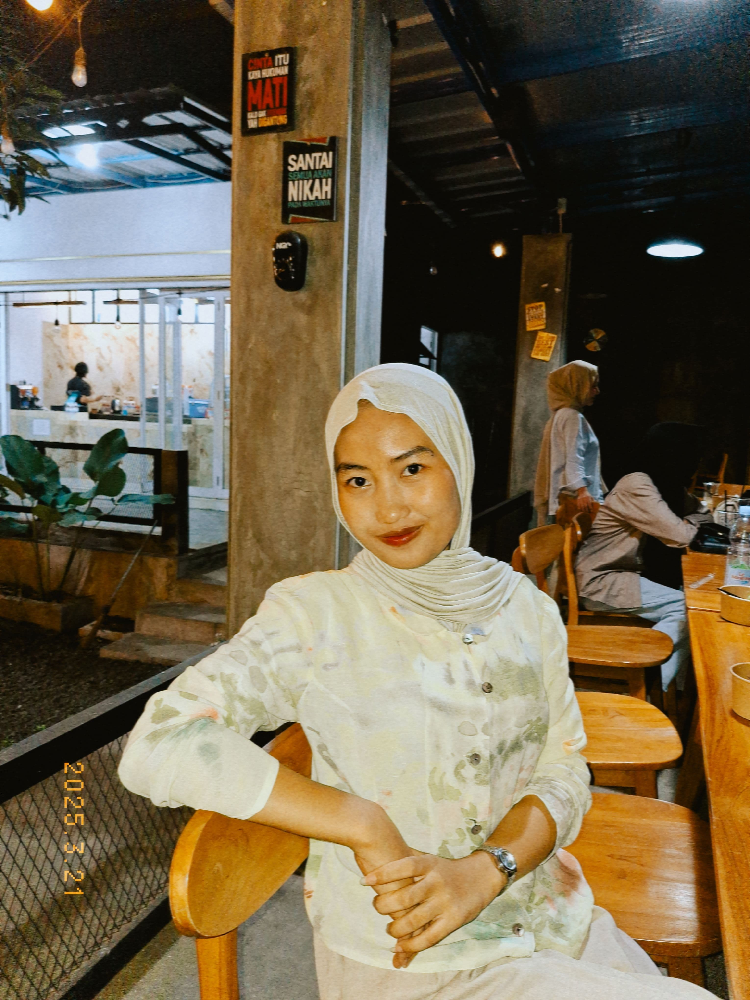

<!DOCTYPE html>
<html lang="id">

<head>
    <meta charset="UTF-8">
    <meta name="viewport" content="width=device-width, initial-scale=1.0">
    <title>Portofolio Naila Fathia</title>
    
</head>

<body>

    <header>
        <h1>Naila Fathia</h1>
        <nav>
            <a href="#tentang">Tentang</a>
            <a href="#projek">Projek</a>
            <a href="#kontak">Kontak</a>
        </nav>
    </header>

    <section class="hero">
        
        <h2>Mahasiswa Universitas Lampung</h2>
        
Program Studi Pendidikan Teknologi Informasi

    </section>

    <section id="tentang">
        <h2>Tentang Saya</h2>
        
Saya Naila Fathia, seorang mahasiswi aktif di jurusan Pendidikan Teknologi Informasi Universitas Lampung. Saya memiliki ketertarikan yang besar dalam dunia teknologi dan pendidikan, khususnya bagaimana teknologi dapat dimanfaatkan untuk menciptakan pengalaman belajar yang lebih interaktif dan menyenangkan.

Meskipun saya belum memiliki pengalaman kerja formal, saya telah mengerjakan beberapa proyek pribadi dan tugas perkuliahan yang mengasah kemampuan saya dalam menggunakan berbagai tools teknologi. Saya juga terus belajar dan mengembangkan diri melalui eksplorasi mandiri dan kerja tim dalam lingkungan akademik.

Saya percaya bahwa menjadi seorang guru di bidang teknologi bukan hanya tentang menguasai materi, tetapi juga tentang membagikan semangat belajar kepada orang lain. Itulah yang menjadi motivasi utama saya untuk terus tumbuh dan berkontribusi di bidang ini. 

       
    </section>

    <section id="projek">
        <h2>Projek</h2>
        <a href="https://youtu.be/MmPQkLqsEyw?si=MLyHFoK-ic1x0GFZ" target="_blank">1. Tokoh Grafika Komputer</a>
        <a href="https://https://youtu.be/txjQat2e4Eg?si=mZ1rPea3-H_nOohHZ" target="_blank">2. Garis dan Perbedaan Dda dan Brasenham.</a>
        <a href="https://youtu.be/AgMhu6yIruQ?si=JwutcmY6WhsLLtL1" target="_blank">3. Lingkaran Brasenham</a>
        <a href="https://https://youtu.be/PQMwNwJUEwk?si=rO1o7eo0k-jvsuiC" target="_blank">4. Kurva</a>
        <a href="https://youtu.be/L4aAnT3sbFE?si=eIvyYo6vtZeesUD4" target="_blank">5. Transformasi 2D</a>
        <a href="https://youtu.be/69sEhnzt3K0?si=_OfSCzbk4AE_1vfZ" target="_blank">6. Clipping</a>
        <a href="https://youtu.be/ShaSItFF8Gg?si=VLWZnYCtuS2271w6" target="_blank">7. Clipping Polygon</a>
    </section>

    <section id="kontak">
        <h2>Kontak</h2>
        
Email: nailafathia123@example.com

        
No. Telepon: 087894590492

        
Instagram: <a href="hhttps://www.instagram.com/nylafthia?igsh=MXczam9mdnRuZHpnaA==" target="_blank">@nailafathia</a>

    </section>

    <footer>
        
&copy; 2025 Naila Fathia. Dibuat dengan cinta dan semangat belajar.

    </footer>

</body>

</html>
